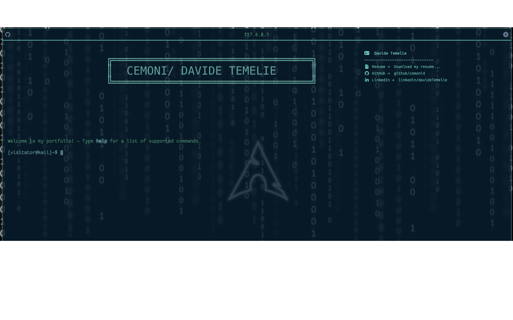

# 🖥️ Terminal Portfolio

Welcome to my **Terminal Portfolio** — a developer portfolio that looks and feels like a real terminal.  
Designed for those who love the command line, cybersecurity, and minimal aesthetics.

 <!-- Sostituisci con uno screenshot reale del tuo portfolio -->

## 🚀 Features

- Terminal-style interface
- Interactive commands (like `help`, `about`, `projects`, `contact`)
- Responsive and mobile-friendly
- Built with HTML, CSS, and JavaScript
- Easily customizable for your own use

## 📦 Tech Stack

- HTML
- CSS
- JavaScript

## ⚡ Available Commands

| Command     | Description                          |
|-------------|--------------------------------------|
| `aboutme`   | Displays who I am                    |
| `social`    | Lists social networks                |
| `projects`  | View coding projects                 |
| `email`     | To send me an email                  |
| `history`   | View command history                 |
| `help`      | Displays this help message           |
| `sudo`      | Try it out for yourself              |
| `snake`     | Run Snake Game                       |
| `clear`     | Clear the terminal                   |

Feel free to try them all in the terminal!

## 📁 Installation

```bash
git clone https://github.com/cemoni4/Terminal-Portfolio.git
cd Terminal-Portfolio
open index.html in your browser
```

## 📜 License

This project is licensed under the MIT License.  
Feel free to fork it, use it, and modify it!
